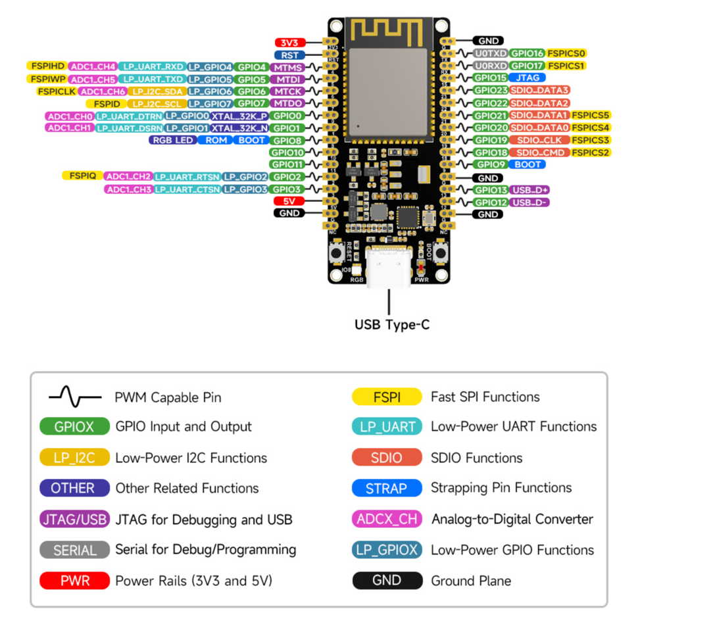

# ESP32-C6 RGB LED Controller with Random Colors

This project demonstrates controlling a WS2812 RGB LED using an ESP32-C6 microcontroller. The LED displays random colors that change at regular intervals.



## Prerequisites

Before you begin, ensure you have the following installed:

- [Rust](https://www.rust-lang.org/tools/install) (version 1.77 or later)
- [ESP-IDF](https://docs.espressif.com/projects/esp-idf/en/latest/esp32c6/get-started/index.html) (version 5.3.2)
- [espflash](https://github.com/esp-rs/espflash) for flashing the firmware
- [ldproxy](https://github.com/esp-rs/embuild/tree/master/ldproxy) for linking
- [espup even for risc-v](https://docs.espressif.com/projects/rust/book/installation/riscv-and-xtensa.html)

## Hardware Requirements

- ESP32-C6 development board
- WS2812 RGB LED
- Appropriate wiring (connect the LED's data pin to GPIO 8 by default)
- USB cable for power and programming

## Setup

This project uses unsafe, because of potential issues with rand and (https://docs.rs/ws2812-esp32-rmt-driver/latest/ws2812_esp32_rmt_driver/driver/struct.Ws2812Esp32RmtDriver.html#)
and RGB GBR color mixing, but it seems there is a problem with 'rand' on esp32c6

1. Clone this repository:
   ```
   git clone <repository-url>
   ```

   2. Install the required Rust target:
      ```
      Linux/Mac users: Install the OS dependencies mentioned in the esp-idf install guide.https://docs.espressif.com/projects/esp-idf/en/latest/esp32/get-started/linux-macos-setup.html#step-1-install-prerequisites
  
      espup install
       # Unix
       . $HOME/export-esp.sh
      ```

3. Install espflash:
   ```
   cargo install espflash
   ```

4. Install ldproxy:
   ```
   cargo install ldproxy
   ```

## Building the Project

To build the project, run:

```
cargo build
```

For a release build with optimizations:

```
cargo build --release
```

## Flashing to the ESP32-C6

Connect your ESP32-C6 board to your computer via USB, then run:

```
cargo run
```

Or use espflash directly:

```
espflash flash target/riscv32imac-esp-espidf/debug/esp32-c6-rgb
```

To flash and monitor the serial output:

```
espflash flash --monitor target/riscv32imac-esp-espidf/debug/esp32-c6-rgb
```

## Configuration

- The default GPIO pin for the WS2812 LED is GPIO 8. You can change this in `src/main.rs`.
- The color change interval is set to 1 second. Modify the sleep duration in `src/main.rs` to change this.

## Project Structure

- `src/main.rs` - Main application code
- `src/ws2812/mod.rs` - WS2812 LED driver implementation using ESP-IDF's RMT peripheral
- `.cargo/config.toml` - Cargo configuration for ESP32-C6 target
- `Cargo.toml` - Project dependencies and configuration

PAY ATTENTION [rust-toolchain.toml](rust-toolchain.toml) is modified for use 'esp' channel not 'nightly' because I had a problem with running it 

## Resources

- [ESP-IDF Rust Book](https://docs.espressif.com/projects/rust/book/introduction.htm)
- [ESP32-C6 Technical Reference Manual](https://www.espressif.com/sites/default/files/documentation/esp32-c6_technical_reference_manual_en.pdf)
- [WS2812 Datasheet](https://cdn-shop.adafruit.com/datasheets/WS2812.pdf)
- [Awesome rust](https://github.com/esp-rs/awesome-esp-rust?tab=readme-ov-file)
- [Board wiki](https://www.waveshare.com/wiki/ESP32-C6-DEV-KIT-N8)